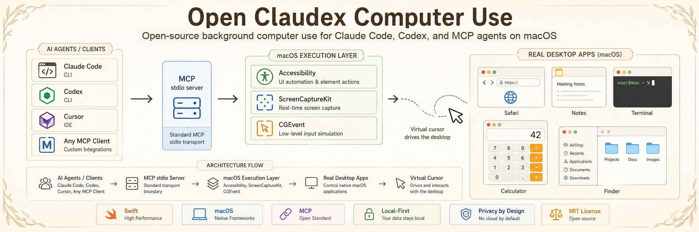
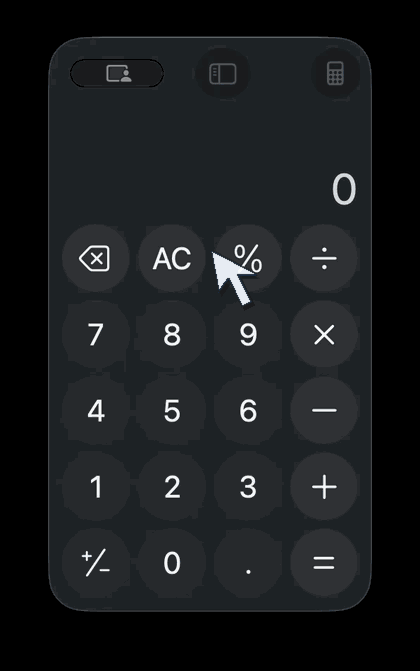
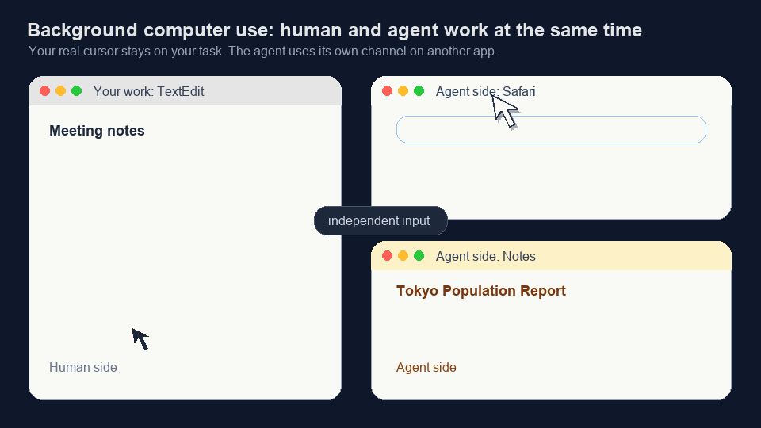
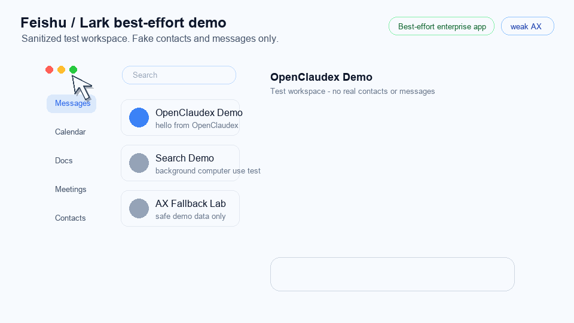

# Open Claudex Computer Use

**English | [简体中文](README.zh-CN.md)**

Open-source background computer use for Claude Code, Codex, and MCP agents on macOS.

[](https://github.com/OpenClaudex/open-claudex-computer-use/releases)
[](LICENSE)
[](docs/install.md)
[](Package.swift)
[](docs/install.md)



## Quick Navigation

- **I'm a human** -> Continue reading this README for demos, setup, compatibility, and project context.
- **I'm an agent** -> Read [CLAUDE.md](CLAUDE.md) for structured operating instructions, key files, and command quick reference.

`claudex-computer-use` is a native Swift MCP server that lets AI agents inspect and operate real Mac apps without moving your real mouse or requiring a cloud desktop.

- **For Claude Code and Codex**: local stdio MCP server plus a Codex plugin scaffold.
- **For real Mac apps**: Safari, Notes, Finder, Calculator, TextEdit, System Settings, and best-effort WebView-heavy apps such as Feishu/Lark.
- **For demos and trust**: app-aware virtual cursor overlay, post-action screenshots, and Codex-style responses.

**Status:** `0.1.0-alpha`

> Not affiliated with Anthropic, OpenAI, Apple, or the official Codex Computer Use plugin.

## Demos

| Native App Control | Background Cross-App Work | Feishu / Lark Best-Effort |
|---|---|---|
|  |  |  |
| Click and read native macOS apps through Accessibility, with a visible virtual cursor. | Let the agent work in Safari and Notes while you keep using the Mac. | Operate WebView-heavy enterprise apps with mixed AX and coordinate fallbacks. Sanitized demo data only. |

## Quick Start

```bash
git clone https://github.com/OpenClaudex/open-claudex-computer-use.git
cd open-claudex-computer-use
swift build
```

### Claude Code

```bash
claude mcp add claudex-computer-use -- "$(pwd)/.build/debug/claudex-computer-use"
claude mcp list
```

### Codex App

Build the project, then add this local plugin directory to Codex:

```text
plugins/claudex-computer-use
```

### Codex CLI / Generic MCP

```json
{
  "mcpServers": {
    "claudex-computer-use": {
      "command": "/absolute/path/to/open-claudex-computer-use/.build/debug/claudex-computer-use"
    }
  }
}
```

Requires macOS 13+, Swift 5.9+, Accessibility permission, and Screen Recording permission. See [Installation & Integration](docs/install.md).

## What It Does

Open Claudex focuses on the native macOS execution layer:

- Reads app state through Accessibility and screenshots.
- Performs clicks, scrolling, dragging, keyboard input, text entry, and AX actions.
- Returns post-action state so agents can continue without excessive re-snapshotting.
- Shows a same-process virtual cursor for observation and recordings.
- Supports both NDJSON and `Content-Length` MCP stdio framing.

For agent-facing usage rules, tool behavior, and recovery patterns, read [Agent Guide](docs/agent-guide.md).

## Compatibility

| Tier | Apps | Expected Behavior |
|---|---|---|
| Stable | Safari, Notes, TextEdit, Calculator, Finder, System Settings | Strong AX tree, screenshots, semantic clicks, `set_value` |
| Limited | Chrome, Edge, VS Code, Slack, Cursor | Partial AX, coordinate fallback, pasteboard-heavy typing |
| Best-effort | WeChat, Feishu/Lark, self-drawn or WebView-heavy surfaces | Sparse AX, unreliable frames, more fallback logic |

Details: [App Compatibility Matrix](docs/compatibility.md)

## Why This Exists

This project started from two converging workflows: Codex-style background computer use and Claude Code-style MCP extensibility. The missing piece was a reusable open-source execution layer: a local macOS MCP server that any agent harness can plug into.

Open Claudex is not a full agent harness. It is the execution engine.

## Docs

- [Installation & Integration](docs/install.md)
- [Agent Guide](docs/agent-guide.md)
- [Demo Pack](docs/demos.md)
- [App Compatibility Matrix](docs/compatibility.md)
- [Testing](docs/testing.md)
- [Codex Native Trace Kit](docs/codex-native-trace-kit.md)
- [Roadmap](ROADMAP.md)

## Related Projects

Open Claudex focuses on the native macOS execution layer. Related projects around computer use and agent desktops:

- [iFurySt/open-codex-computer-use](https://github.com/iFurySt/open-codex-computer-use) - open-source Codex-style computer-use MCP server.
- [trycua/cua](https://github.com/trycua/cua) - sandbox, SDK, and infrastructure for full desktop computer-use agents.
- [browser-use/macOS-use](https://github.com/browser-use/macOS-use) - making macOS apps accessible to AI agents.

## License

[MIT](LICENSE)
